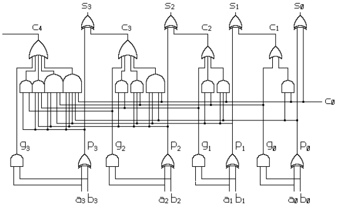
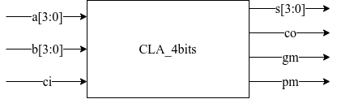
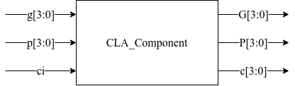
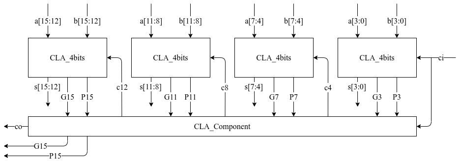
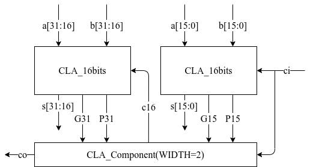
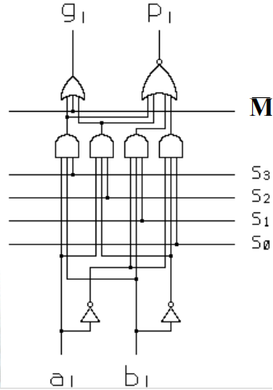
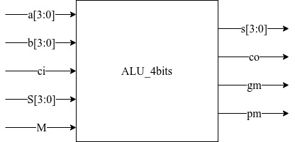
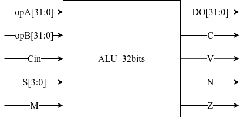

# 32bits CLA and ALU Verification

## 📦 关于本仓库

基于Verilog实现32位块间超前的超前进位加法器(Carry-Lookahead Adder, CLA)，与实现一些逻辑运算的ALU。基于System Verilog实现testbench验证。

⚠️ 基于[iverilog](https://github.com/steveicarus/iverilog)平台

## 📚 目录结构

<details>   
    <summary>展开查看</summary>
    ├─ alu
	│  ├─ src，ALU RTL
    │  │  ├─ alu_4bits.v，4位ALU
    │  │  ├─ alu_16bits.v，16位ALU
    │  │  ├─ alu_32bits.v，32位ALU
    │  │  ├─ alu_ref.v，任意位宽ALU参考模型
    │  │  └─ cla_component.v，CLA组件模块
    │  └─ test，ALU testbench
    │  │  ├─ alu_4bits_tb.sv，4位ALU验证
    │  │  ├─ alu_32bits_tb_random.sv，32位ALU随机验证
    │  │  └─ alu_32bits_tb.sv，32位ALU覆盖验证
    ├─ cla
    │  ├─ src，CLA RTL
    │  │  ├─ cla_4bits.v，4位CLA
    │  │  ├─ cla_16bits.v，16位CLA
    │  │  ├─ cla_32bits.v，32位CLA
    │  │  └─ cla_component.v，CLA组件模块
    │  └─ test，CLA testbench
    │  │  ├─ cla_4bits_tb.sv，4位CLA验证
    │  │  ├─ cla_16bits_tb_cover.sv，16位CLA覆盖验证（测试项更少）
    │  │  └─ cla_16bits_tb_random.sv，16位CLA随机验证
    │  │  └─ cla_16bits_tb.sv，16位CLA覆盖验证
    │  │  ├─ cla_32bits_tb_random.sv，32位CLA随机验证
    │  │  └─ cla_32bits_tb.sv，32位CLA覆盖验证
    └─ docs，文档相关
</details>

## 🛠️ CLA与ALU结构

### 🧩 CLA结构

4位CLA电路原理图如图所示：



4位CLA模块如图所示：



其中，

- $a[3:0]$、 $b[3:0]$：操作数；
- $c_i$：进位输入；
- $s[3:0]$：运算结果；
- $c_o$：进位输出；
- $g_m$、 $p_m$：最高位 $G$、 $P$；

  $$
  g_i = a_i\land p_i,\quad g_m=g[3]
  $$

  $$
  p_i=a_i \oplus b_i,\quad p_m=p[3]
  $$

4位CLA模块包含CLA_Component，通过 $g$、 $p$计算各 $G$、 $P$及进位 $c$：

$$
P[i]=p[i]\land P[i-1], \quad i > 0
$$

$$
P[0]=p[0]
$$

$$
G[i]=g[i]\ \lor\ (p[i]\ \land\ G[i-1]), \quad i > 0
$$

$$
G[0]=g[0]
$$

$$
c[i]=G[i-1]\ \lor\ P[i-1]\ \land\ c[0],\quad i>0
$$

$$
c[0]=c_i
$$

其模块结构如图所示：



由4个4位CLA组成16位CLA，其模块结构如图所示：



4个4位CLA分别处理4位，各自产生的最高位 $G$、 $P$输入CLA_Component做处理，以产生进位 $c_4$、 $c_8$、 $c_{12}$及 $c_o$( $c_{16}$)送入下一个CLA处理或输出，实现块间超前。最后，16位CLA输出进位输出 $c_o$、最高位 $G$、 $P$。

用两个16位CLA模块与位宽为2的CLA_Component模块组成32位CLA模块，并实现块间超前，其模块结构如图所示：



### 🧩 ALU结构

ALU在CLA基础上添加 $S[3:0]$、 $M$信号，通过选择控制信号 `{S,Cin,M}` 完成多个逻辑运算指令，如表所列：

| $S_3$ | $S_2$ | $S_1$ | $S_0$ | $C_{in}$ | $M$ | 逻辑                                                | 功能      |
| ------- | ------- | ------- | ------- | ---------- | ----- | --------------------------------------------------- | --------- |
| 0       | 0       | 0       | 0       | 1          | 0     | 0                                                   | 置全0     |
| 0       | 0       | 0       | 1       | 1          | 0     | $\neg A\land\neg B$                               | nor       |
| 0       | 0       | 1       | 0       | 1          | 0     | $\neg A\land B$                                   | not and   |
| 0       | 0       | 1       | 1       | 1          | 0     | $\neg A$                                          | not$A$  |
| 0       | 1       | 0       | 0       | 1          | 0     | $A\land\neg B$                                    | and not   |
| 0       | 1       | 0       | 1       | 1          | 0     | $\neg B$                                          | not$B$  |
| 0       | 1       | 1       | 0       | 1          | 0     | $A\land\neg B\lor \neg A\land B$                  | xor       |
| 0       | 1       | 1       | 1       | 1          | 0     | $\neg A\lor\neg B$                                | nand      |
| 1       | 0       | 0       | 0       | 1          | 0     | $A\land B$                                        | and       |
| 1       | 0       | 0       | 1       | 1          | 0     | $A\land B\lor\neg A\land \neg B$                  | xnor      |
| 1       | 0       | 1       | 0       | 1          | 0     | $B$                                               | 传送$B$ |
| 1       | 0       | 1       | 1       | 1          | 0     | $A\land B\lor\neg A\land B\lor\neg A\land \neg B$ | not or    |
| 1       | 1       | 0       | 0       | 1          | 0     | $A$                                               | 传送$A$ |
| 1       | 1       | 0       | 1       | 1          | 0     | $A\land B\lor A\land\neg B\lor\neg A\land\neg B$  | or not    |
| 1       | 1       | 1       | 0       | 1          | 0     | $A\land B\lor A\land\neg B\lor\neg A\land B$      | or        |
| 1       | 1       | 1       | 1       | 1          | 0     | 1                                                   | 置全1     |
| 1       | 0       | 0       | 1       | 0          | 1     | $A\oplus B\oplus C$                               | 加法      |
| 0       | 1       | 1       | 0       | 1          | 1     | $(A\neg\oplus B)\oplus C$                         | 减法      |

⚠️ $\neg A$，指对 $A$进行位取反； $\oplus$，异或操作(^)

修改底层4位CLA为ALU，添加 $S[3:0]$、 $M$输入端口，在 $a_i$、 $b_i$信号产生 $p_i$、 $g_i$信号之前，根据如下公式插入该逻辑：

$$
p=\overline{S_3\cdot a\cdot b+S_2\cdot a\cdot\bar{b}+S_1\cdot\bar{a}\cdot b+S_0\cdot\bar{a}\cdot\bar{b}}
$$

$$
g=S_3\cdot a\cdot b+S_2\cdot a\cdot\bar{b}+\bar{M}
$$

此时， $p_i$、 $g_i$信号生成逻辑如图所示：



由此，4位ALU模块结构如图所示，端口含义与4位CLA类似：



32位ALU的设计与32位CLA的设计类似，首先通过4个4位ALU生成16位ALU，再通过两个16位ALU生成32位ALU。由于ALU的逻辑运算功能以通过增加底层控制 $p$、 $g$信号逻辑实现，因此直接例化前述模块即可。32位ALU模块结构如图所示：



32位ALU（顶层模块）还需增加如下标志位输出：

- 溢出位 $V$：表示运算结果超出数的表示范围。通过两个操作数与输出数据的最高位，判断溢出位：

  - `assign V = ({opA[31], opB[31], DO[31]} == 3'b001) | ({opA[31], opB[31], DO[31]} == 3'b110)；`
  - 还可判断30位向31位与31位向32位进位是否相同，不同则为溢出；
- 符号位 $N$：取输出结果的最高位 `assign N=DO[31]`；
- 输出全0指示信号 $Z$：`assign Z = ~(|DO)；`

## 🧪 CLA与ALU验证

### 🔬 CLA验证

iverilog命令：

```shell
cd ./cla/test
iverilog -g2012 -o vvp_cla_32bits_tb cla_32bits_tb.sv ../src/*
# vvp_cla_32bits_tb will be generated
./vvp_cla_32bits_tb
```

- 对4位CLA验证：由于位宽较少，可遍历操作数 $A$、 $B$及进位输入$c_i$，判断计算结果与真实结果是否相同。
- 对16位CLA验证：

  - `cla_16bits_tb.sv` 为全覆盖验证，但由于位宽较多，遍历操作数 $A$、 $B$及进位输入 $c_i$耗时很长，修改其中循环遍历的上限为2^12^较好。
  - `cla_16bits_tb_random.sv` 为随机验证，随机输入100万种操作数 $A$、 $B$及进位输入 $c_i$组合，并进行比对。
  - `cla_16bits_tb_cover.sv` 为一种更优的验证方式，由于16位CLA由4个4位CLA组成，而在前面已验证4位CLA功能正确，其中前三个CLA均可贡献其进位( $c_4$、 $c_8$、 $c_{12}$)。因此，依次考虑这三个CLA，第一个CLA功能正确，则无需考虑操作数 $A$、 $B$的 $[3:0]$位，仅需考虑 $c_4$对块间超前模块做出的贡献，则此次仅需遍历： $2^{12}\cdot 2^{12}\cdot 2=2^{25}$次；接着第二个CLA功能正确，则无需考虑 $A$、 $B$的 $[7:0]$位，仅需考虑 $c_8$……共需要遍历 $2^{25}+2^{17}+2^{9}$次，比全覆盖验证的 $2^{33}$次少了很多。
- 对32位CLA验证：

  - `cla_32bits_tb.sv` 为全覆盖验证；
  - `cla_32bits_tb_random.sv` 为随机验证，随机输入100万种操作数 $A$、 $B$及进位输入 $c_i$组合，并进行比对。

### 🚚 ALU参考模型

ALU参考模型位于 `/alu/src/alu_ref.v`，其操作通过 `case ` 实现对不同选择控制信号 `{S,Cin,M}` 的指令执行，因此可作为ALU的参考模型；进位输出 $C$根据 $M$、 $Cin$的取值分别计算得出。其他的逻辑标志位算法其实与前述ALU设计相同。

### 🔬 ALU验证

iverilog命令：

```shell
cd ./alu/test
iverilog -g2012 -o vvp_alu_32bits_tb alu_32bits_tb.sv ../src/*
# vvp_alu_32bits_tb will be generated
./vvp_alu_32bits_tb
```

- 对4位ALU验证：由于位宽较少，可遍历操作数 $opA$、 $opB$及18个选择控制信号 `{S,Cin,M}`，判断计算结果与ALU参考模型的结果是否相同。
- 对32位ALU验证：
  - `alu_32bits_tb.sv` 为全覆盖验证；
  - `alu_32bits_tb_random.sv` 为随机验证，随机输入100万种操作数 $opA$、 $opB$，遍历18个选择控制信号 `{S,Cin,M}`，并与ALU参考模型的结果比对。
